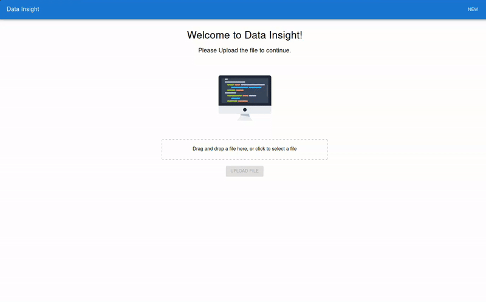
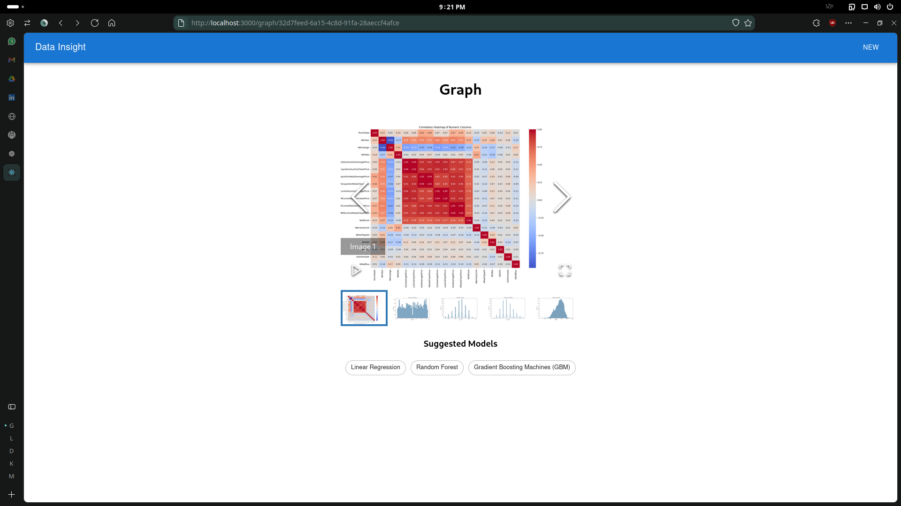
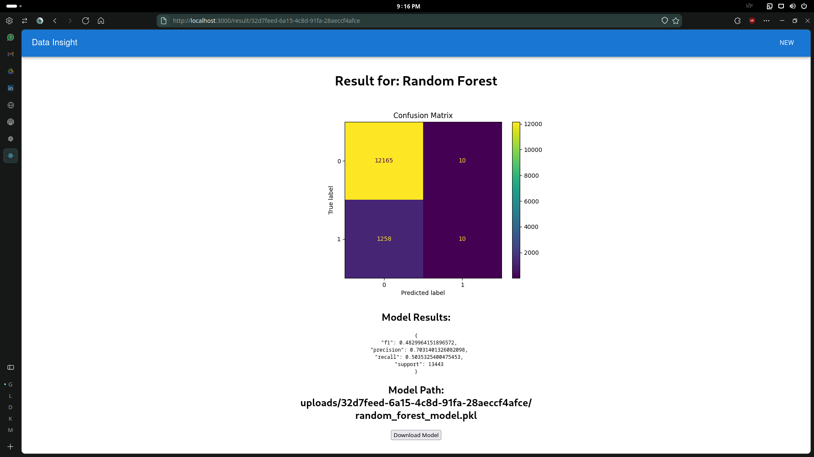

# Data Insight

Data Insight is a web application designed to help data analysts and scientists generate insights from CSV data files. It uses AI to visualize data, suggest the best machine learning models, and assist in the creation of these models. The app leverages powerful tools like the Deepseek-Coder-V2 model, hosted via Ollama, and integrates with LangChain to help automate data analysis tasks.

## Demo


## Tech Stack
- **Backend**: Python (Flask)
- **Frontend**: React.js
- **AI Model**: Deepseek-Coder-V2
- **Model Serving**: Ollama
- **Data Processing & Visualization**: Pandas, Matplotlib, Seaborn
- **AI Integration**: LangChain (Python)
- **Machine Learning**: scikit-learn

## Prerequisites
Make sure you have the following installed:

- Python 3.10 or higher
- Node.js (>=14.x)
- npm (>=6.x)

## Installation

### 1. Clone Repositories

#### Backend
```bash
# Clone the backend repository
git clone https://github.com/dedsec995/Data-Insight-Backend.git
cd data-insight-backend
```

#### Frontend
```bash
# Clone the frontend repository
git clone https://github.com/dedsec995/Data-Insight-Frontend.git
cd data-insight-frontend
```

### 2. Set Up Backend

#### Install Python Dependencies
Navigate to the backend directory and install the required Python dependencies:

```bash
cd data-insight-backend
pip install -r requirements.txt
```

#### Install Ollama on Linux
Ollama is used to serve the Deepseek-Coder-V2 model. Run the following command to install Ollama:

```bash
curl -fsSL https://ollama.com/install.sh | sh
```

Once Ollama is installed, download the Large Language model:

```bash
ollama pull deepseek-coder-v2
```
This will download the required model for use in the application

If you are on any other platform or want more detailed installation instructions, you can visit [Ollama's official installation page.](https://ollama.com/)

#### Run the Backend Server
To start the Flask application, execute:

```bash
python app.py
```

The backend server will start and listen on `http://127.0.0.1:5000` by default.

### 3. Set Up Frontend

Navigate to the `data-insight-frontend` directory:

```bash
cd ../data-insight-frontend
```

#### Install Node.js Dependencies# Getting Started with Create React App

This project was bootstrapped with [Create React App](https://github.com/facebook/create-react-app).

## Available Scripts

In the project directory, you can run:

### `npm start`

Runs the app in the development mode.\
Open [http://localhost:3000](http://localhost:3000) to view it in your browser.

The page will reload when you make changes.\
You may also see any lint errors in the console.

### `npm test`

Launches the test runner in the interactive watch mode.\
See the section about [running tests](https://facebook.github.io/create-react-app/docs/running-tests) for more information.

### `npm run build`

Builds the app for production to the `build` folder.\
It correctly bundles React in production mode and optimizes the build for the best performance.

The build is minified and the filenames include the hashes.\
Your app is ready to be deployed!

See the section about [deployment](https://facebook.github.io/create-react-app/docs/deployment) for more information.

### `npm run eject`

**Note: this is a one-way operation. Once you `eject`, you can't go back!**

If you aren't satisfied with the build tool and configuration choices, you can `eject` at any time. This command will remove the single build dependency from your project.

Instead, it will copy all the configuration files and the transitive dependencies (webpack, Babel, ESLint, etc) right into your project so you have full control over them. All of the commands except `eject` will still work, but they will point to the copied scripts so you can tweak them. At this point you're on your own.

You don't have to ever use `eject`. The curated feature set is suitable for small and middle deployments, and you shouldn't feel obligated to use this feature. However we understand that this tool wouldn't be useful if you couldn't customize it when you are ready for it.

## Learn More

You can learn more in the [Create React App documentation](https://facebook.github.io/create-react-app/docs/getting-started).

To learn React, check out the [React documentation](https://reactjs.org/).

### Code Splitting

This section has moved here: [https://facebook.github.io/create-react-app/docs/code-splitting](https://facebook.github.io/create-react-app/docs/code-splitting)

### Analyzing the Bundle Size

This section has moved here: [https://facebook.github.io/create-react-app/docs/analyzing-the-bundle-size](https://facebook.github.io/create-react-app/docs/analyzing-the-bundle-size)

### Making a Progressive Web App

This section has moved here: [https://facebook.github.io/create-react-app/docs/making-a-progressive-web-app](https://facebook.github.io/create-react-app/docs/making-a-progressive-web-app)

### Advanced Configuration

This section has moved here: [https://facebook.github.io/create-react-app/docs/advanced-configuration](https://facebook.github.io/create-react-app/docs/advanced-configuration)

### Deployment

This section has moved here: [https://facebook.github.io/create-react-app/docs/deployment](https://facebook.github.io/create-react-app/docs/deployment)

### `npm run build` fails to minify

This section has moved here: [https://facebook.github.io/create-react-app/docs/troubleshooting#npm-run-build-fails-to-minify](https://facebook.github.io/create-react-app/docs/troubleshooting#npm-run-build-fails-to-minify)

To run the React application:

```bash
npm start
```

The frontend server will start and listen on `http://localhost:3000` by default.

### 4. Run the Application
Make sure both the backend and frontend servers are running. Open a browser and navigate to `http://localhost:3000` to start using the Data Insight application.

## Screenshots
### Data Visualization


### Model



## Usage
- Upload a CSV file for analysis.
- Generate visualizations and insights with the help of AI.
- Get suggestions for the best machine learning models for your data.
- Build and evaluate machine learning models directly in the app.

## Contributing
Contributions are welcome! Please fork the repository and submit a pull request with your improvements or bug fixes.


